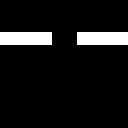

# Robotic Motion Planning - Final Project

## Table of Contents

- [Task](#task)
- [Installation](#installation)
- [Project Description](#project_description)
- [Training Procedure](#training_procedure)
- [Usage](#usage)

## Task
Sampling based approaches for robotic motion planning suffer from the ability to find a valid path in scenes with critical narrow passageways. My project proposal is a machine-learning based solution recommending a sample point in the scene’s narrow passageway.
A convolutional neural network which reads as input the image describing the scene: including its source, target and obstacles, and outputs two parameters describing the recommended sample point in the narrow passageway.
To keep the project contained we’ll focus on a single disc robot translating in the plane.

## Installation
```sh
git clone https://github.com/AdiAlbum1/robotic-motion-planning-final-project
cd robotic-motion-planning-final-project
pip install -r requirments.txt
```

## Project Description
- ```python stage_1.py ``` : Reads as input the JSON files from ```input_json_obstacles/``` contatining the scene's description, and generates binary images of the scene's obstacles
- ``` python stage_2.py``` : Randomly augments obstacles onto the images of the scenes
- ``` python stage_3.py``` : Translate each scene along the y-axis, and rotate at 90, 180, and 270 degrees
- ``` python train.py``` : Trains a Convolutional Neural Network for the above regression task
- ``` improved_prm.py``` : Our product. An improved PRM implementation where the first sampled point is given by the CNN

## Training Procedure
1. Randomly select a base obstacle map with a single critical passageway.
   <br>We manually generated multiple base obstacles maps with single critical passageways using CGAL's scene designer.
   The JSON files describing the scenes were tranformed to images using ```stage_1.py```
   The generated scenes contain various obstacle maps with passageways at positions (0,0), (1,0), ..., (8,0)
   as in the following images
    * (0,0):
    <br>\_1.png)   \_2.png)
    * (3,0):
    <br>\_1.png)   \_2.png)
    * (6,0):
    <br>\_1.png)   \_2.png)

2. Randonly translate the obstacle map along the y-axis
    * (0,0) - randomly translated along the y-axis:
    <br>   
## Usage
TBD